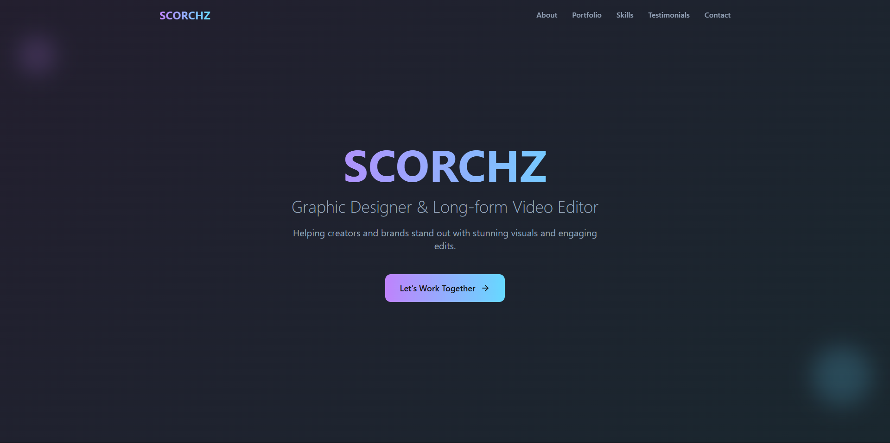

# Garry's Portfolio

A modern and responsive portfolio website built to showcase my design and development work, including projects, visuals, and creative ideas.

> Designed and developed by Garry

---

## Features

- Clean, minimal UI with smooth transitions  
- Fully responsive across all screen sizes  
- Dedicated sections for projects, about, and contact  
- SEO-ready with Open Graph and Twitter card support  
- Fast loading with modern frontend tooling  

---

## Tech Stack

- Framework: React (with Vite)  
- Styling: Tailwind CSS  
- Languages: TypeScript, HTML5, CSS3  

---

## Folder Structure

```bash
.
├── public/
│   └── index.html
├── src/
│   ├── main.tsx
│   ├── App.tsx
│   ├── assets/
│   └── components/
├── tailwind.config.js
├── tsconfig.json
└── package.json
```

---

## Getting Started

To run this project locally:

```bash
# 1. Clone the repository
git clone https://github.com/your-username/Portfolio-Design.git
cd Portfolio-Design

# 2. Install dependencies
npm install

# 3. Run the development server
npm run dev
```

Then open your browser and go to `http://localhost:5173` to view the site.

---

## Preview




---

## Contact

For freelance work, collaborations, or design inquiries:

- Instagram: [@meenapushpendra400](https://www.instagram.com/meenapushpendra400/)
- Email: meenapushpendra400@gmail.com  
- GitHub: [@Garry400](https://github.com/Garry400)

---

## License

This project is open source and available under the MIT License.
